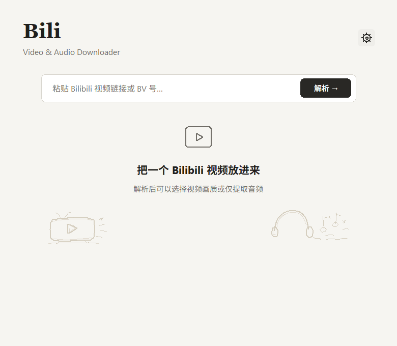

# Bili

一款简洁、温暖的 Windows Bilibili 视频与音频下载工具。

[](https://github.com/Hikaru232572/bilibili-downloader-gui/releases/latest)
[](#系统要求)
[](LICENSE)



## 功能

- 支持完整 Bilibili 视频链接、分享文本和独立 `BV` 号。
- 解析并展示视频封面、标题、UP 主、时长和 BV 号。
- 按实际可用格式选择视频清晰度并保存为 MP4。
- 单独提取 MP3 或 WAV 音频。
- 检测视频原生字幕，并可选择嵌入最终视频。
- 支持浏览器 Cookie、`cookies.txt` 和游客三种模式。
- 内嵌下载进度、取消、完成和错误状态。
- 单窗口设置页；已解析的视频可连续切换 Video / Audio 并重复下载。
- 便携版已内置 `yt-dlp`、`aria2c`、`ffmpeg` 和 `ffprobe`。

## 下载与使用

前往 [Releases](https://github.com/Hikaru232572/bilibili-downloader-gui/releases/latest)，下载：

```text
Bili-v1.0.0-windows-x64.zip
```

解压后运行：

```text
BilibiliDownloader.exe
```

无需安装 Python，也不需要单独配置下载工具。

基本流程：

1. 粘贴 Bilibili 视频链接或 BV 号。
2. 点击“解析”。
3. 选择 Video 或 Audio。
4. 选择视频清晰度，或选择 MP3 / WAV。
5. 点击下载按钮。

## 系统要求

- Windows 10 / 11 x64
- 可访问 Bilibili 和 GitHub 的网络环境
- 部分高清视频、会员或登录可见内容需要有效 Cookie

## Cookie 设置

设置页提供三种模式：

- **浏览器**：让 `yt-dlp` 读取本机浏览器配置。
- **cookies.txt**：选择 Netscape 格式的 Cookie 文件。
- **不使用**：以游客身份解析可访问内容。

如果 Chrome / Edge 提示 Cookie 数据库无法复制，建议将登录状态导出为 `cookies.txt` 后使用文件模式：

- [Chrome / Edge：Get cookies.txt LOCALLY](https://chromewebstore.google.com/detail/get-cookiestxt-locally/cclelndahbckbenkjhflpdbgdldlbecc)
- [Firefox：cookies.txt](https://addons.mozilla.org/firefox/addon/cookies-txt/)

> Cookie 文件等同于登录凭据。请勿提交到 Git、上传到网盘或分享给他人。本项目已默认忽略 `settings.json`、`cookies.txt` 和本机构建目录。

## 字幕说明

程序只显示视频 metadata 中已经存在的原生字幕轨道，不负责翻译、语音转写或生成字幕。选择保存字幕后，现有字幕会通过 ffmpeg 嵌入最终 MP4。

## 从源码运行

需要：

- Windows
- Python 3.12+
- PowerShell

```powershell
python -m venv .venv
.\.venv\Scripts\python.exe -m pip install -r requirements.txt
powershell -NoProfile -ExecutionPolicy Bypass -File .\setup_tools.ps1
.\launch.bat
```

`setup_tools.ps1` 会准备以下工具：

- `yt-dlp.exe`
- `aria2c.exe`
- `ffmpeg.exe`
- `ffprobe.exe`

## 构建便携版

```powershell
powershell -NoProfile -ExecutionPolicy Bypass -File .\build_portable.ps1
```

输出目录：

```text
dist\BilibiliDownloader
```

## 测试

```powershell
powershell -NoProfile -ExecutionPolicy Bypass -File .\run_tests.ps1
```

测试包含命令构造、URL 规范化、metadata、UI 状态、Windows 原生窗口、工具检查、真实 Bilibili 解析、短媒体下载和打包程序启动。

## 项目结构

```text
app.py              主界面、状态管理及下载流程
ui_kit.py           项目内置的 Tk UI 组件
assets/             应用图标源文件
artifacts/          README 与验收截图
tests/              自动化测试
setup_tools.ps1     下载并校验 Windows 工具
build_portable.ps1  构建便携版
run_tests.ps1       运行完整测试
launch.bat          从源码启动
```

## 致谢

本项目基于 [Lani27/bilibili-downloader-gui](https://github.com/Lani27/bilibili-downloader-gui) 继续开发，保留其 Bilibili 下载核心，并重新设计了单窗口产品体验、UI、设置和下载状态交互。

底层能力来自：

- [yt-dlp](https://github.com/yt-dlp/yt-dlp)
- [aria2](https://github.com/aria2/aria2)
- [FFmpeg](https://ffmpeg.org/)

## 许可

项目遵循 [MIT License](LICENSE)，并保留原项目版权声明。
